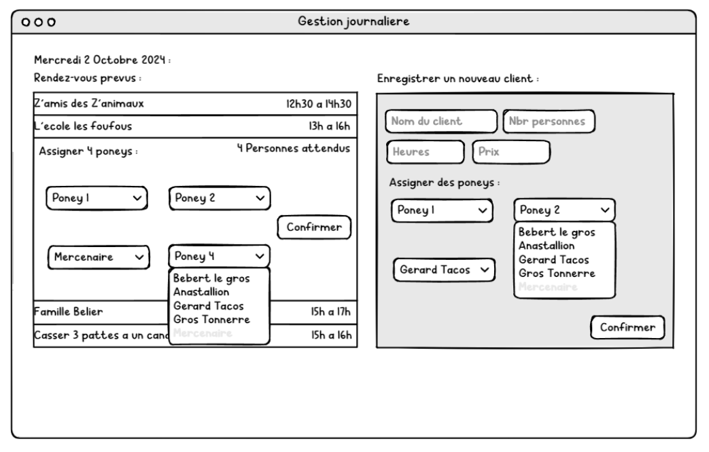
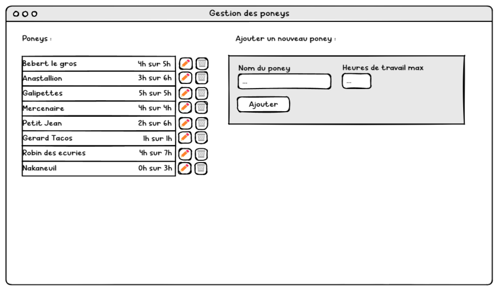
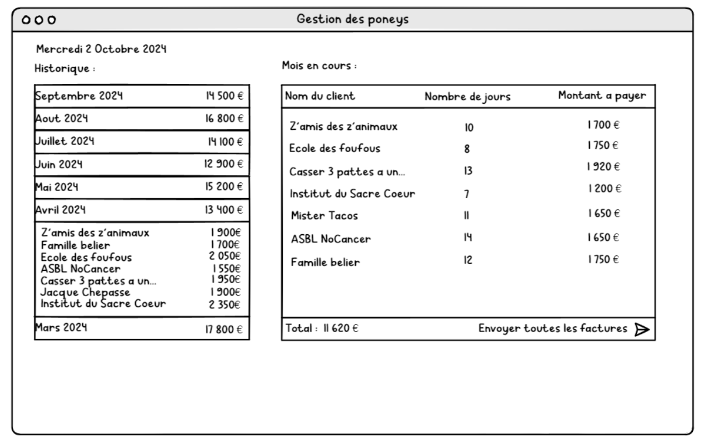

# Specifications Document – Digitization of the Hypotherapy Center

## Context:
The hypotherapy center provides support to individuals in vulnerable situations through equestrian activities. Currently, arrivals, pony management, and invoicing are handled manually on paper. The goal is to modernize these processes with a web application that offers a view of available ponies, daily management for efficiency upon client arrival (pony assignment, etc.), and smart invoicing to ease billing procedures.

## Target Audience:
The application will only be used by employees and administrative staff.

## Content:
The application will feature CRUD pages and display KPIs related to pony management, and it will be available in only one language: French.

## Features:

### 1. Daily Management:
- This page will present:
  - A list of scheduled appointments for the day, showing the client's name, number of people expected, and the time slot (e.g., 12:30–14:30).
  - Each appointment can be clicked to open a menu that allows the correct number of ponies to be assigned to the group.
  - An interface for spontaneously registering new clients who weren’t initially scheduled for the day, where their name, group size, total price, and duration (hours) can be entered.
  - The ability to assign the appropriate number of ponies to each group.

### 2. Pony Management:
- This page will include a list of registered ponies, showing their names and working hours. It will also allow for the modification or removal of ponies from the list.
- An interface for adding new ponies at any time will be provided.

### 3. Invoice Management:
- This page will contain a history of the center’s revenue, allowing the user to click on a specific month to view more details.
- An interface displaying the current month's revenue details will be available, along with a simplified invoicing feature.

